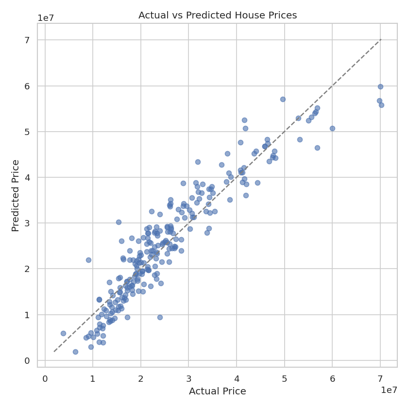
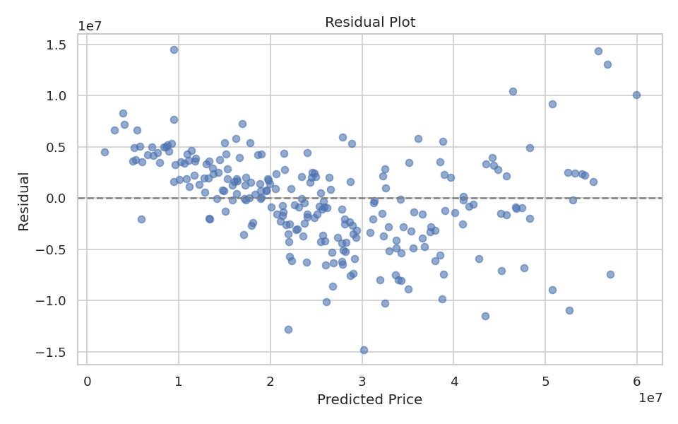
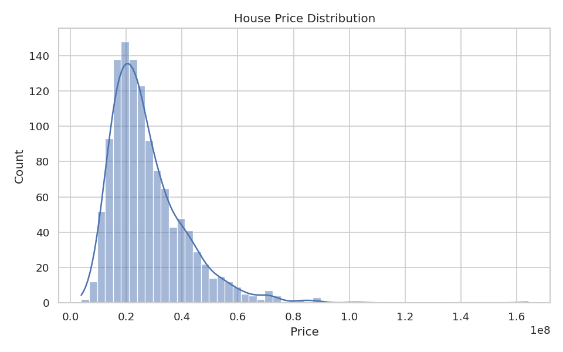
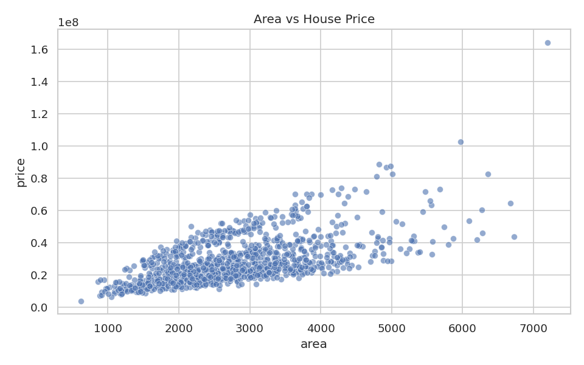
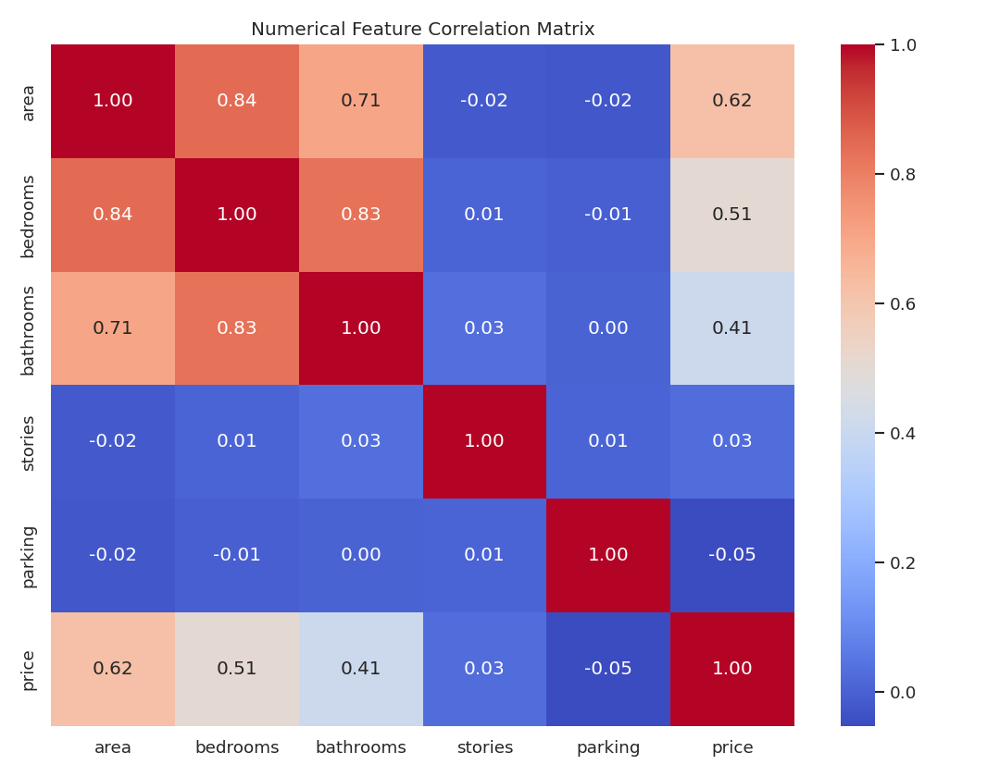
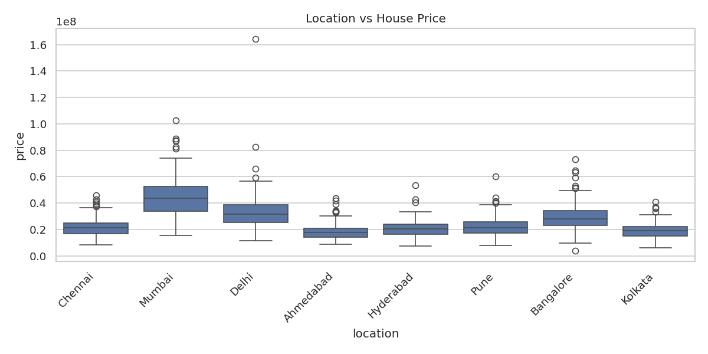

# House Price Prediction

End-to-end Linear Regression pipeline that predicts house prices from property
features (area, bedrooms, bathrooms, amenities, location, and more), with a
Streamlit app for interactive predictions.

## Dataset

Kaggle isn't reachable from the environment this project was built in, so
`generate_dataset.py` creates a synthetic-but-realistic dataset
(`data/house_prices.csv`, 1200+ rows) with the same shape as the well-known
Kaggle "Housing Price Prediction" dataset: numeric features (`area`,
`bedrooms`, `bathrooms`, `stories`, `parking`), yes/no amenity flags
(`mainroad`, `guestroom`, `basement`, `hotwaterheating`, `airconditioning`,
`prefarea`), a `furnishingstatus` category, and a `location` column across
eight Indian cities. It also seeds in a few missing values, duplicate rows,
and outliers on purpose, so the cleaning and imputation code in `train.py`
has something real to do instead of running on already-perfect data.

The city price-per-square-foot multipliers and amenity "bonuses" in
`generate_dataset.py` are illustrative assumptions for a self-contained,
reproducible dataset (fixed random seed) -- not real market data.

**To use a real dataset instead:** download a housing dataset from Kaggle and
replace `data/house_prices.csv`. `train.py` and `app.py` both detect numeric
vs. categorical columns dynamically, so nothing else needs to change unless
the price column is named something other than `price` (update the `TARGET`
constant at the top of `train.py`).

## Project structure

```
house-price-prediction/
├── data/
│   └── house_prices.csv
├── notebooks/
│   └── house_price_analysis.ipynb   # exploration, mirrors train.py, pre-executed
├── models/
│   ├── house_price_model.pkl        # fitted preprocessing + regression pipeline
│   └── metrics.json                 # last training run's metrics + schema
├── reports/figures/                 # EDA and evaluation plots (see below)
├── generate_dataset.py              # builds data/house_prices.csv
├── train.py                         # load -> clean -> EDA -> train -> evaluate -> save
├── compare_models.py                # Ridge / Random Forest comparison + cross-validation
├── app.py                           # Streamlit prediction UI
├── requirements.txt
└── README.md
```

## Setup

```bash
python -m venv venv
source venv/bin/activate      # venv\Scripts\activate on Windows
pip install -r requirements.txt
```

## Running it

```bash
python generate_dataset.py    # (optional) regenerate data/house_prices.csv
python train.py               # train, evaluate, save the model + plots
python compare_models.py      # (optional) Ridge / Random Forest + cross-validation
streamlit run app.py          # interactive prediction UI
```

Or open `notebooks/house_price_analysis.ipynb` for the same workflow with
inline plots and narrative explanation.

## Results

Linear Regression, evaluated on a held-out 20% test split (241 rows):

| Metric | Value |
|---|---|
| MAE  | 3,608,940.80 |
| MSE  | 21,250,953,478,188.25 |
| RMSE | 4,609,875.65 |
| R²   | 0.8607 |

MAE and RMSE are in the same units as `price` (INR). R² of 0.86 means the
model explains about 86% of the price variance in the test set; the
remaining gap comes from the non-linear and noise components baked into the
synthetic price formula, by design, so linear regression cannot fit it
perfectly.

**Actual vs. predicted:**



**Residuals** (roughly centered on zero with no strong funnel or curve,
which is what you want to see from a linear model):



### Model comparison (`compare_models.py`)

| Model | MAE | RMSE | R² |
|---|---|---|---|
| Linear Regression | 3,608,940.80 | 4,609,875.65 | 0.8607 |
| Ridge (alpha=1.0) | 3,599,683.49 | 4,605,505.58 | 0.8610 |
| Random Forest | 2,540,972.74 | 3,426,950.00 | 0.9230 |

Random Forest scores noticeably higher, which is expected -- it can capture
the non-linear relationship between area and price that a straight line
can't. Linear Regression remains the required baseline for this project.

**5-fold cross-validation** (Linear Regression, R² per fold):
`[0.7582, 0.8771, 0.8688, 0.8615, 0.8768]` -- mean **0.8485**, std **0.0455**.
Performance is reasonably consistent across folds, with one softer fold that
would be worth investigating (e.g. checking whether it happens to contain
more of the seeded outliers).

### More EDA plots

| Price distribution | Area vs. price | Correlation heatmap | Price by location |
|---|---|---|---|
|  |  |  |  |

## Implementation notes

- **Preprocessing lives inside the pipeline** (`ColumnTransformer` +
  `SimpleImputer` + `OneHotEncoder`, wrapped with `LinearRegression` in one
  `Pipeline`), so imputation medians/modes and one-hot categories are learned
  from the training split only -- no leakage from the test set.
- **Numeric/categorical detection is dtype-based, not name-based**
  (`select_dtypes(include="number")`, everything else treated as
  categorical). This was checked against the actual pandas version in the
  build environment (pandas 3.0), which gives plain string columns their own
  `"str"` dtype instead of `"object"` -- code that only checks for
  `"object"` silently drops every categorical column on newer pandas, so the
  dtype-agnostic version here is the safer default.
- `app.py` builds its input form from `models/metrics.json` (the schema the
  model was actually trained on) and from the value ranges in
  `data/house_prices.csv`, rather than hardcoding field names, so it keeps
  working if the dataset is swapped.

## Possible extensions

- Feature engineering (price-per-square-foot, property age if available)
- Hyperparameter tuning for Ridge/Random Forest (`GridSearchCV`)
- A held-out final test set kept untouched through model selection
- Investigate the weaker cross-validation fold and the largest residuals
